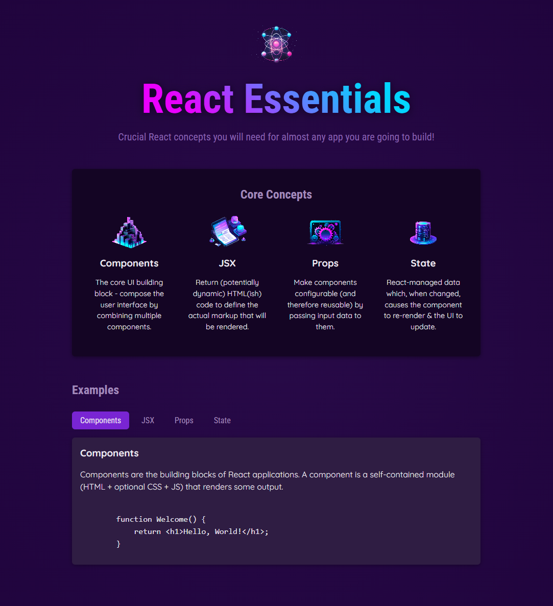

# React Essentials

This is a simple React project that introduces fundamental React concepts that are essential for building modern web applications.
<br><br>


## 🚀 Getting Started

### **Prerequisites**
Make sure you have the following installed before running the project:
- **Node.js** (Download from [nodejs.org](https://nodejs.org/))
- **npm** or **yarn** (Comes with Node.js)
<br>

### **Installation**
1. Clone this repository:
   ```sh
   git clone https://github.com/nathenpriyonggo/react-essentials-start
   ```
2. Navigate to the directory
   ```sh
   cd react-essentials-start
   ```
3. Install dependencies:
   ```sh
   npm install
   ```
4. Start the development server:
   ```sh
   npm run dev
   ```
5. Open ```http://localhost:5173/``` in your browser.
<br>

## 🛠️ Built With
- **React** - A JavaScript library for building user interfaces
- **Vite** - A fast build tool for modern web projects
<br>

## 🖥️ Preview
<p align="center"></p>
<br>

## 📜 License
This project is open-source. Feel free to modify and expand upon it!
<br><br>


---

✨ Happy coding! 🚀
